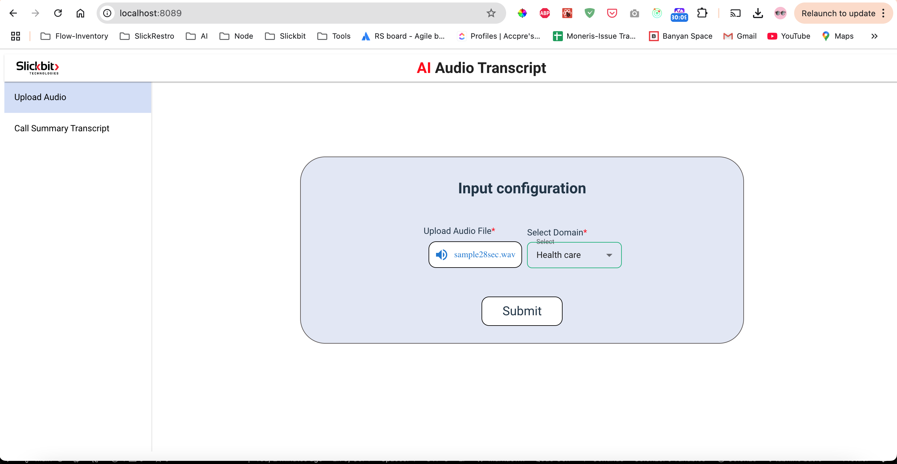
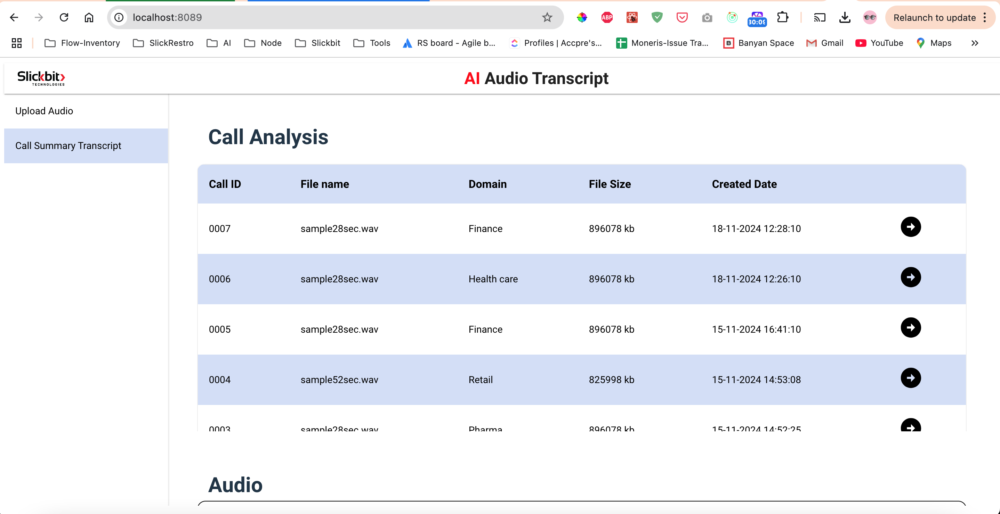
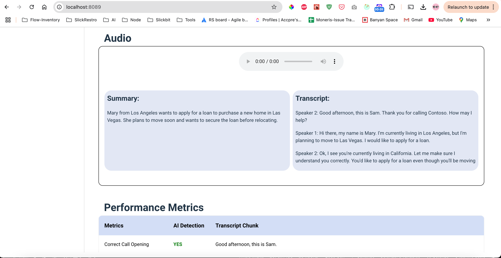
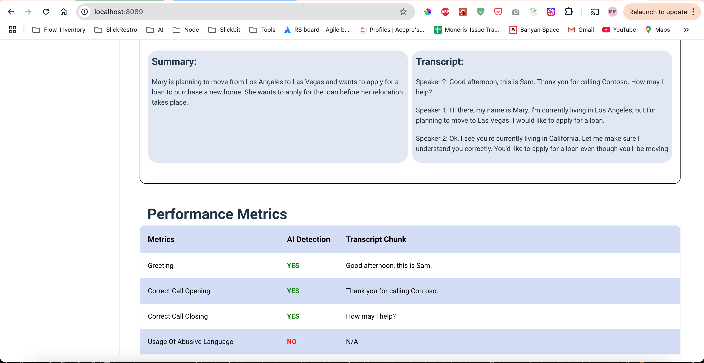

# AI-Audio Transcript

> Extract transcripted data, based on uploaded audio file using AI.

## 📦 Installation

Follow these steps to set up the project locally.

### Prerequisites

- [Node.js](https://nodejs.org/) (version 16 or above)
- [React.js](https://react.dev/) (version 18 or above)

### Steps

1. **Clone the repository**
   - git clone https://github.com/SlickbitTechnologies/ai-audio-transcript.git
  
2. **Navigate into the project directory**
    - cd ai-audio-transcript

3. **Install dependencies**
    - npm install

4. **Start the development server**
    - npm run dev

**The app should now be running on** http://localhost:8089

---

🧩 **Usage**

Setting Up Environment Variables:

Create a .env file in the root of your project and add below 4 lines, Replace your-api-key with your openAi secret key and aws secret keys as well. And create a empty folder named uploads in root level for storing temporary files

> PORT=8089

> OPENAI_KEY=your-api-key

> AWS_ACCESS_KEY_ID=your-access-key-id

> AWS_SECRET_ACCESS_KEY=your-secret-access-key

---

📞 Contact
- info@slickbit.com
